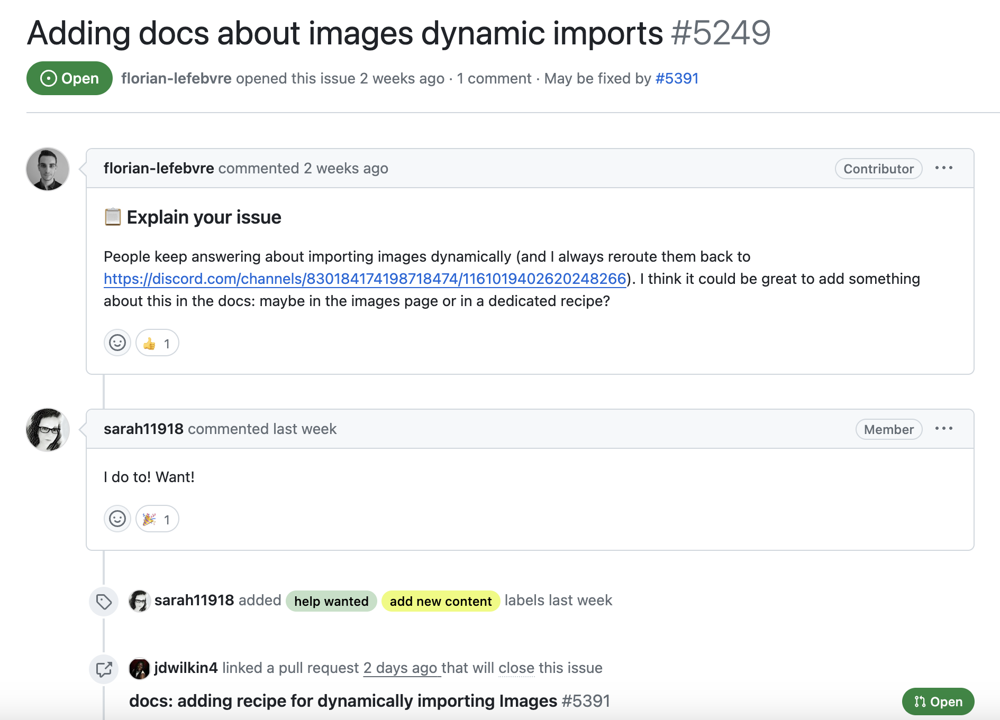

When you are first getting started with open source, it can be intimidating to find good issues to contribute to. The few open issues that are beginner-friendly seem to have high competition for them. So how do you find good issues to contribute to?

## Look for help wanted labels

A lot of people will go straight for the issues labeled "good first issue" or "beginner friendly". While these are great issues to get started with, they are grabbed up quickly.

Instead, look for issues labeled "help wanted" or "good for new contributors". These issues are often good for new contributors and often don't have as many eyes on them as the "beginner friendly" issues.

When I first started contributing to the [Astro documentation](https://docs.astro.build/en/getting-started/), I saw a lot of active conversation on issues marked with the "help wanted" label but no one was working on them. There seemed to be a lot of interest by the maintainers but it looked like they just didn't have the time to create a PR for the matter. So I decided to take a stab at it.

For example, [this issue](https://github.com/withastro/docs/issues/5249) was opened a few weeks ago about adding a new recipe to the docs on dynamic image imports.

There was also a long discussion thread on Discord about how to do dynamic image imports in Astro. After I read through the complete thread, I was able to create a small tutorial on how to do dynamic image imports in Astro using Vite's `import.meta.glob` function.

While this PR is still under review, there is already some great feedback and appreciation from the maintainers. 😀

## Look for smaller projects

A lot of people will flock to the larger libraries and open-source projects to find issues to contribute to. While these projects are great, sometimes it can get competitive to find issues.

At freeCodeCamp, whenever we create an issue marked with "first timers only", there are easily 2-3 PRs created within the first few hours. This is great, but it can be intimidating for new contributors to compete with other contributors to get their PR merged.

Even some of the "help wanted" issues get picked up pretty quickly and people might feel like they are competing with other contributors.

So my advice is to look for smaller projects that don't have as many eyes on them.

An example of this would be [Josh Goldberg's Create TypeScript App](https://github.com/JoshuaKGoldberg/create-typescript-app/issues). There are currently about 50 open issues and most of them are marked with the "status: accepting prs" label. A lot of them are even marked "good first issue".

I have contributed to this project a few times in the past and it is a great project to contribute to. Josh is very responsive and appreciative of the contributions.

By contributing to smaller projects, you can get your feet wet with open source and get some experience under your belt. You will learn a lot in the process and build more connections in this industry.

## Participate in issue discussions

A lot of repositories will have dozens of open issues marked with the "needs triage" label which means that the maintainers haven't had a chance to triage the issue yet. A triage is when the maintainers go through the issue and determine if it is a bug, feature request, or question.

Sometimes the maintainers are overwhelmed with issues and these triaged issues go untouched for weeks or even months. You can help out with this by participating in the issue discussions and offering suggestions for possible solutions.

While I would not advise creating a PR for these issues before they have been marked ready for contribution, you can still help out by offering suggestions and helping the maintainers triage the issue. This is a great way to show other developers your problem-solving and communication skills. Oftentimes, the maintainers will be so appreciative of your help that they will offer you a chance to work on the issue.

## Participate in Discord discussions

A lot of open-source projects have a Discord server where you can chat with other contributors and the maintainers. This is a great way to get to know the maintainers and other contributors.

Another reason to get involved with the Discord server is that a lot of people will ask questions about the project and often these discussions will lead to creating a new issue or feature request. If you are active on the Discord server, you can help offer suggestions and even start to create issues for these discussions. You never know which issues will be available for contribution.

## Conclusion

Getting started with open source can be intimidating, but it doesn't have to be. There are a lot of great issues out there for new contributors to work on. You just have to know where to look. 😀

I would suggest joining a supportive community like the [Open Sauced Discord community](https://discord.com/invite/U2peSNf23P) where you can ask questions on how to get started and find suggestions for good repositories to contribute to.
