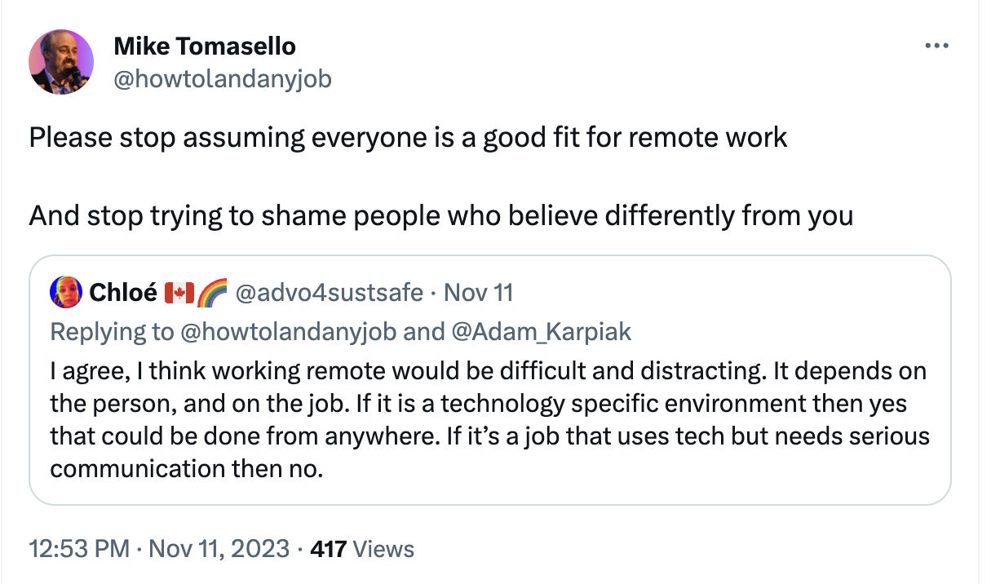

The pandemic ushered in a new wave of remote work opportunities and a lot of people have embraced the changes. But this has also brought up the question of whether remote work is for everyone.

I recently ran across a [Twitter post](https://twitter.com/howtolandanyjob/status/1723443950483366328) by [Mike Tomasello](https://twitter.com/howtolandanyjob) on remote work and was inspired to write about my own experience working remotely in tech.

## Life before Tech and remote work

Before I started working in tech, I was a professional musician and music teacher. There was no such thing as working remotely and I was traveling all around Southern California for gigs.

Here was one of the common jokes among all of us professional musicians:

"Which orchestra do you play with?"

"The Freeway Philharmonic." 🤣

I never imagined a life where I wasn't driving all over the place and instead worked from home. But when the pandemic hit it opened up a whole new world of work possibilities.

## My first remote tech jobs

My first few tech jobs were part-time contract work where I got to work from home. My first job was working 10 hours a week as a junior developer for a small company. My role was to work on the smaller tasks that the senior developers didn't have time for.

We had very few meetings and I had a flexible schedule. This was a huge contrast to my music career where there were set times for rehearsals and performances.

For my second part-time job, I was a staff writer for freeCodeCamp. It was a similar situation, where we only had one meeting at the beginning of the week and then we got to work on own our schedule.

We were still getting out of the pandemic but I enjoyed the new freedom in schedule. I didn't miss going to a physical location for work and didn't miss the commute.

## My first full-time remote tech job

About a year and a half into my learning and part-time jobs, I landed my first full-time role as a software engineer. This schedule was different because I had to be available during certain hours for meetings and to work with my team. But I didn't mind that and I still got to work from home.

Because of the time difference between me and the rest of my team, I usually started earlier in the day and ended earlier. I have always been a morning person so this new schedule worked out great for me.

Also, I have strong communication skills, so I was able to still be connected with my team and reach out for help when I needed it.

Even though the world was back to normal, I still didn't miss going into an office. I was able to get my work done and still have time to do other things. Also, did I mention I didn't have to commute in LA traffic? 🤣

## Is everyone suited for remote work?

Even though I have had positive experiences with remote work, I don't think it is suited for everyone. One thing you have to have with remote work is the ability to communicate well.

Some people get lost in their own world and disconnect from the team. If you try that in an office, then the team will notice and reach out to you. But with a remote setting, if the team is having a hard time getting a hold of you, then that can come back to bite you.

Another thing you have to have is the ability to work on your own. If you are the type of person who needs to be around people to get work done, then remote work is not for you.

I have always been a self-starter and I can get work done on my own. I can minimize distractions and focus on the task at hand. I attribute that to my many years in a practice room as a musician.

But some people need the structure of an office to get work done. They need to be around people to stay motivated. If that is you, then remote work is not for you.

Also, I have had coworkers who found remote work to be lonely at times and missed the social aspect of an office. For me, I was never really bothered with that but for some of you, you might want to be around people in an office setting and that is okay.

## Conclusion

For some people, remote work is a dream come true. For others, it is a nightmare.

For me, I love the freedom and flexibility that remote work provides. I can work from the comfort of my home and I don't have to commute in LA traffic. 🤣

But also, remote work is not for everyone and that is okay. We all have different personalities and different work styles. The important thing is to find what works for you and go with it. 😀
